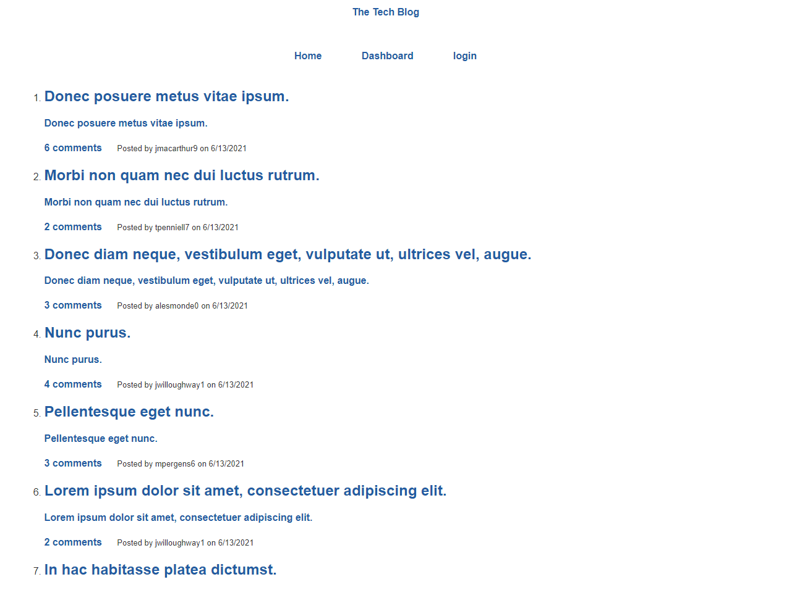
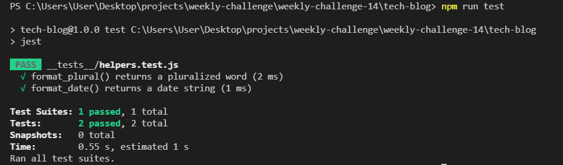

# Tech blog

## Description 

  Blog site for publishing articles, blog posts, thoughts and opinions. Some of the main tools/packages utilized in this project are Node.js, express, sequelize, mysql2 and express-handlebars.

  Deployed link - https://dkbaffour-tech-blog.herokuapp.com/

  

## Installation

  - Clone/Download the project
  - From the tech-blog directory in your terminal/command line run 'npm install'
  
## Usage 
  - Create a .env file to hold your database credentials
  - From the home page you can:
    - use the login navigation to sign in or sign up.
    - click on a post to view the title, contents, creator, date created
    - click on a post to add a comment(only when logged in)
  - From the dashboard you can:
    - create update a new post
    - view all posts
    - click on your post to add a comment
    - click on your post to update or delete buy clicking the edit post button
  
## Tests
  - Run 'npm run test' command in the readmegen directory in your command line/terminal
  

## Questions
  - 👋 Hi, I’m dkbaffour777
  - GitHub profile link: [github.com/dkbaffour777/](https://github.com/dkbaffour777/)
  - 📫 How to reach, email: dkbaffour777career@gmail.com
